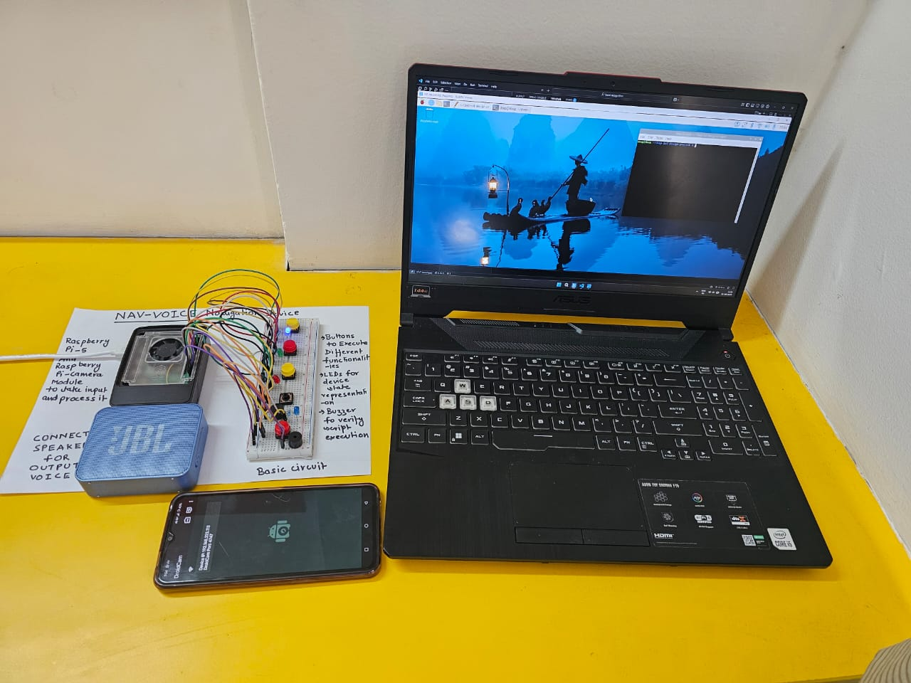
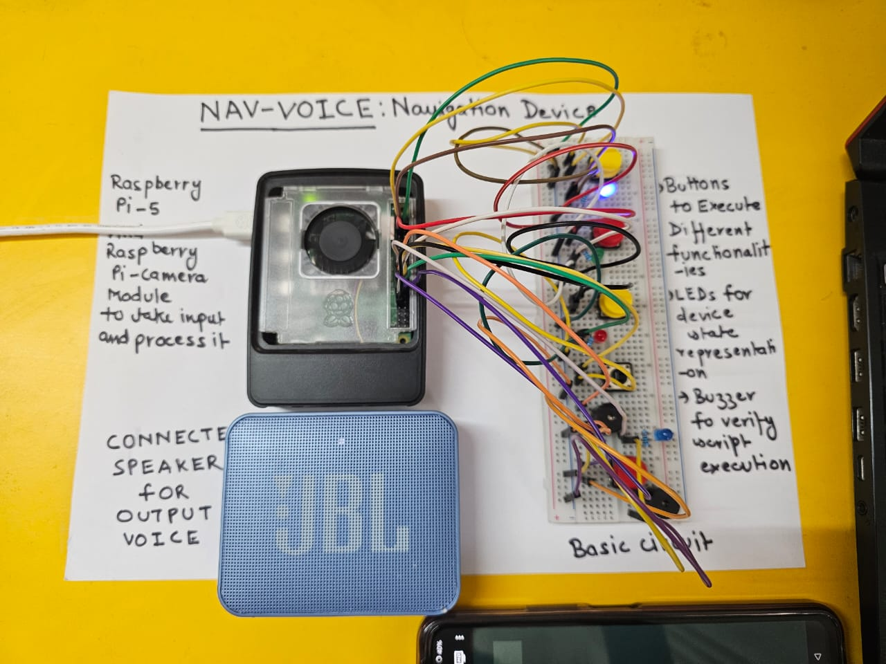

# Nav-Voice-Assistive-Device

This repository contains the code base and performance analysis of **NavVoice** —  
*"An Artificial Intelligence based Assistive Device for Visually Challenged Persons."*

---

### 📺 Demo

Watch the demo of the NavVoice device here: [Watch Here]([https://www.youtube.com/watch?v=V9Kyx8cnkaY])

---

### 📸 Device Images

